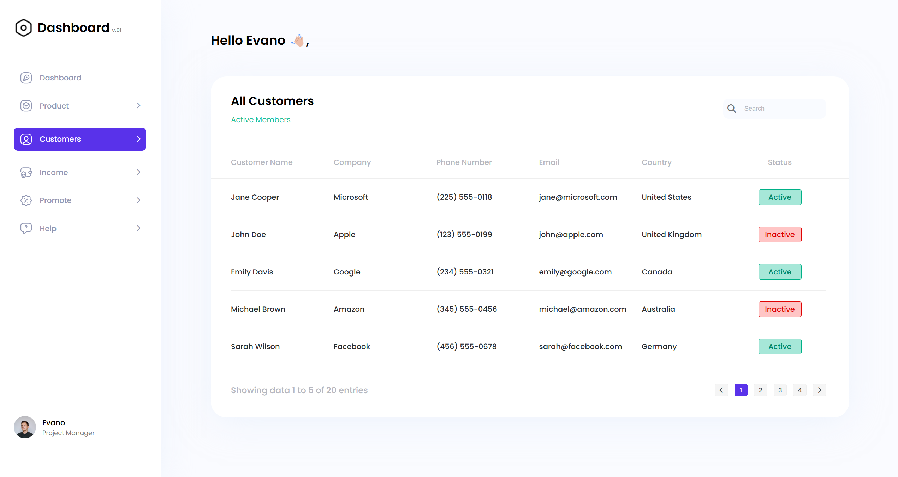
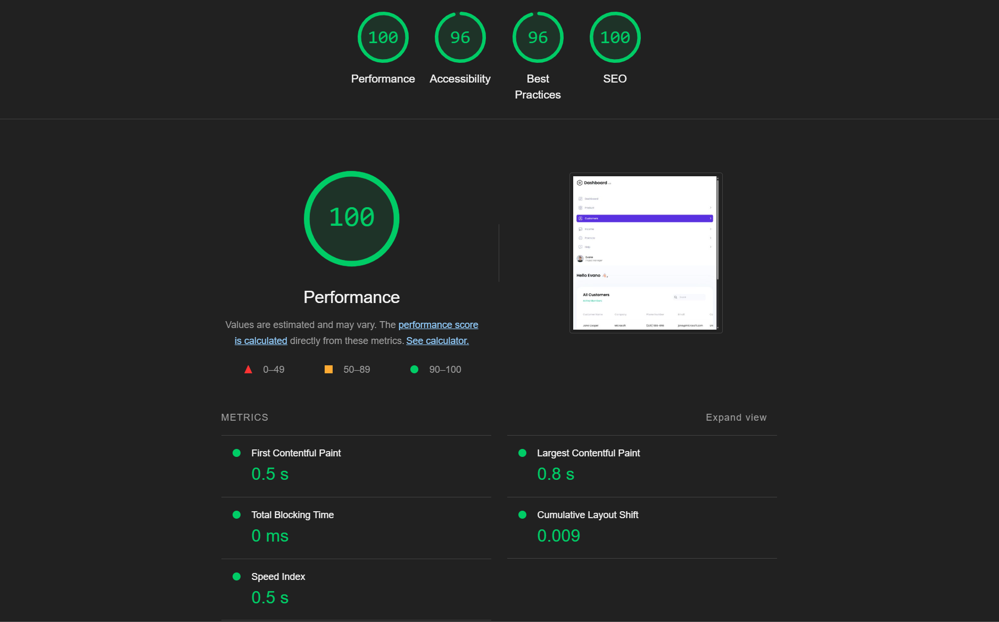

# Dashboard Project

This project is a simple dashboard interface with a sidebar, main content area, and customer data table. It uses Pug for templating, JavaScript for interactivity, and CSS for styling.



## Features

- **Dynamic Templating**: The UI is built with Pug templates.
- **Responsive Design**: Styled with CSS to ensure compatibility across devices.
- **Data Pagination**: Automatically splits customer data into pages for better usability.
- **Search Functionality**: Filter customer data by name or email in real-time.
- **Navigation Sidebar**: Interactive sidebar for navigating between sections.

---

## Lighthouse Report



---

## Project Structure

```
/project-root
├── dist/ # Compiled HTML output
├── src/ # Source files
│ └── css/ # Stylesheets
│ └── js/ # JavaScript files
│ └── views/ # Pug templates
│ └── data/ # JSON data files
│ └── assets/ # Images and other assets
├── .gitignore
├── package.json
├── node_modules/
└── README.md
```

---

## Getting Started

### Prerequisites

Ensure you have the following installed:

- [Node.js](https://nodejs.org/) (version 16 or later)
- npm (comes with Node.js)

### Installation

1. Clone the repository:

   ```bash
   git clone https://github.com/xelilovkamran/CRM-dashboard-interview-task.git
   cd project-root
   ```

2. Install dependencies:
   ```bash
    npm install
   ```
3. Compile the Pug templates:
   ```bash
    npm run build
   ```
4. Watch for changes:
   ```bash
    npm run watch
   ```
5. Open the `dist/index.html` file in your browser.
